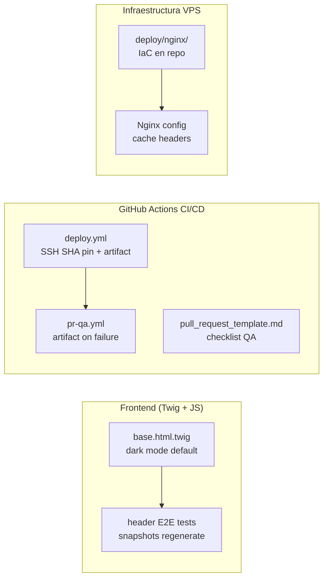
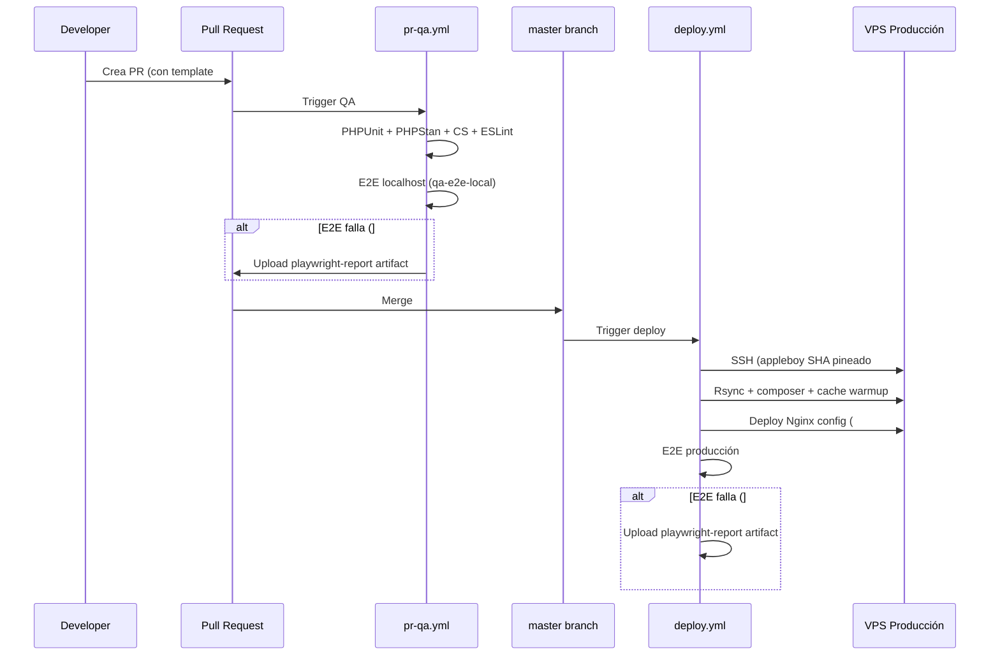

# Design — Mejoras transversales: CI/CD, UX & Infraestructura

## Contexto

- **Issues**: #47 · #255 · #259 · #260 · #263
- **Fecha**: 2026-03-20
- **Agent team**: portfolio-sdd-team-032026

---

## Diagrama de Alcance



---

## ADR-01 — Dark mode: cambio mínimo en JS vs detección por media query

**Decisión**: Cambiar el valor por defecto en JavaScript (`|| 'dark'`) en lugar de
usar `prefers-color-scheme` CSS media query.

**Razones**:
- El sistema actual ya usa JS para gestionar el tema (localStorage + `data-theme`)
- Introducir `prefers-color-scheme` añadiría complejidad sin beneficio claro
- El issue #263 especifica "dark por defecto en desktop", no "respetar preferencia del sistema"
- Cambio mínimo = menor riesgo = mejor para esta iteración

**Ficheros afectados**:
- `templates/base.html.twig` línea ~146: `|| 'light'` → `|| 'dark'`
- `templates/base.html.twig` línea ~94: icono toggle `sun` → `moon`

**Trade-off**: Un usuario que prefiera light mode en desktop deberá activarlo
manualmente (click en toggle). Comportamiento esperado y documentado.

---

## ADR-02 — Cache headers Nginx: query-string versioning vs filename fingerprint

**Decisión**: Implementar query-string versioning con `APP_VERSION` de Symfony
antes de activar `Cache-Control: immutable`.

**Razones**:
- Los assets actuales no tienen fingerprinting (paths literales en templates Twig)
- Activar `immutable` sin cache-busting bloquearía actualizaciones durante 1 año
- Symfony Asset Component con `json_manifest_strategy` requiere build step (no disponible)
- Query-string con `?v={{ app_version }}` es simple y funciona con el PHP built-in de dev

**Implementación en 2 pasos**:
1. Añadir `?v={{ app_version() }}` a assets en `base.html.twig`
2. Configurar Nginx con `Cache-Control: public, immutable` para rutas con `?v=`

**Ficheros afectados**:
- `templates/base.html.twig`: añadir `?v={{ app.version }}` a CSS y JS
- `deploy/nginx/portfolio.conf`: nueva config (IaC)
- `.github/workflows/deploy.yml`: paso de copia de config Nginx al VPS

---

## ADR-03 — Config Nginx: Infrastructure as Code en el repo

**Decisión**: Crear `deploy/nginx/portfolio.conf` en el repo y desplegarlo
automáticamente en el pipeline de deploy.

**Razones**:
- Mantenibilidad: la config Nginx es parte del sistema, debe versionarse
- Reproducibilidad: fácil recrear el entorno de producción
- Auditabilidad: los cambios de Nginx quedan en el historial de git

**Estructura**:
```
deploy/
└── nginx/
    └── portfolio.conf    # Config Nginx con cache headers
```

**Paso en deploy.yml** (post-rsync):
```yaml
- name: Deploy Nginx config
  run: |
    scp deploy/nginx/portfolio.conf ${{ secrets.SSH_USER }}@${{ secrets.SSH_HOST }}:/etc/nginx/sites-available/portfolio
    ssh ${{ secrets.SSH_HOST }} "sudo nginx -t && sudo systemctl reload nginx"
```

---

## ADR-04 — Playwright artifacts: naming con run_id

**Decisión**: Nombrar los artifacts con `github.run_id` para unicidad.

**Deploy workflow (producción)**:
```yaml
name: playwright-report-prod-${{ github.run_id }}
path: playwright-report/
retention-days: 7
```

**PR workflow (localhost)**:
```yaml
name: playwright-report-pr-${{ github.event.pull_request.number }}-${{ github.run_id }}
path: playwright-report/
retention-days: 7
```

**Nota**: Verificar que `playwright-report/` está expuesto desde el contenedor Docker.
El `docker-compose.yml` monta el código fuente como volumen, pero `playwright-report/`
se genera dentro del contenedor por Playwright. Puede requerir un volumen adicional
o un `docker cp` previo al `upload-artifact`.

---

## Diagrama de Flujo CI/CD (post-cambios)



---

## Impacto por capa

| Capa | Ficheros afectados | Issues |
|------|-------------------|--------|
| Frontend/Twig | `templates/base.html.twig` | #263 |
| E2E Tests | `playwright/tests/header/header.desktop.spec.ts`<br/>`playwright/tests/home/home.desktop.spec.ts`<br/>`playwright/components/header/index.ts`<br/>~30 snapshots desktop | #263 |
| CI/CD Workflows | `.github/workflows/deploy.yml`<br/>`.github/workflows/pr-qa.yml` | #255 · #259 |
| PR Governance | `.github/pull_request_template.md` | #260 |
| Infraestructura | `deploy/nginx/portfolio.conf` (nuevo)<br/>`templates/base.html.twig` (versioning assets) | #47 |

---

## Riesgos y Mitigaciones

| Riesgo | Prob | Impacto | Mitigación |
|--------|------|---------|------------|
| SHA incorrecto en ssh-action rompe deploy | Baja | Crítico | Verificar SHA contra releases oficiales antes de mergear |
| `playwright-report/` no accesible desde runner | Media | Medio | Verificar con un test de fallo intencionado en rama |
| `immutable` sin cache-busting bloquea CSS | Media | Alto | ADR-02: implementar versioning antes de `immutable` |
| Snapshots desktop no regenerados → E2E roto en PR | Alta | Medio | Checklist en PR template (RF-05) + `make e2e-update-snapshots` |
| Config Nginx en repo rompe VPS en deploy | Baja | Crítico | `nginx -t` antes de `systemctl reload` en el pipeline |
