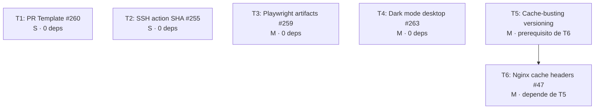

# Tasks — Mejoras transversales: CI/CD, UX & Infraestructura

## Contexto

- **Issues originales**: #47 · #255 · #259 · #260 · #263
- **Fecha**: 2026-03-20
- **Agent team**: portfolio-sdd-team-032026

---

## Grafo de Dependencias

**T1, T2, T3, T4, T5 pueden implementarse en paralelo.**
**T6 requiere T5 completada.**

---

## T1 — Actualizar pull_request_template.md

**Issue**: #260 | **Sizing**: S | **Prioridad**: MUST

**Descripción**: El template existe pero necesita un checklist QA más completo.

**Ficheros**:
- `.github/pull_request_template.md` (actualizar)

**Acceptance criteria**:
- [ ] Sección tipo de cambio con checkboxes (feat/fix/refactor/chore/docs)
- [ ] Checklist incluye: `make qa`, `make e2e`, `make e2e-update-snapshots` (si hay cambios visuales), no secrets, Conventional Commits en título, `Closes #`
- [ ] No interfiere con el body generado por `auto-release-pr.yml`

**Tareas**:
1. Leer el template actual
2. Ampliar con los nuevos ítems del checklist
3. Verificar que el formato Markdown es correcto

---

## T2 — Pinear appleboy/ssh-action por SHA

**Issue**: #255 | **Sizing**: S | **Prioridad**: MUST

**Descripción**: Reemplazar el tag flotante `@v1` por SHA completo verificado.

**Ficheros**:
- `.github/workflows/deploy.yml` (1 línea)

**Acceptance criteria**:
- [ ] `appleboy/ssh-action@<SHA>  # vX.Y.Z` en `deploy.yml`
- [ ] SHA verificado en https://github.com/appleboy/ssh-action/releases
- [ ] Deploy funcional post-cambio (QA en PR)

**Tareas**:
1. Verificar la versión actual instalada y el SHA de la última release estable
2. Actualizar la línea en `deploy.yml`
3. Añadir comentario con la versión legible

**Nota**: `manual-deploy.yml` no existe. Solo hay que cambiar `deploy.yml`.

---

## T3 — Subir Playwright report como artifact en fallo E2E

**Issue**: #259 | **Sizing**: M | **Prioridad**: SHOULD

**Descripción**: Añadir `upload-artifact@v4` con `if: failure()` en ambos workflows E2E.

**Ficheros**:
- `.github/workflows/deploy.yml` (job `e2e`)
- `.github/workflows/pr-qa.yml` (job `qa-e2e-local`)

**Acceptance criteria**:
- [ ] Step `upload-artifact@v4` con `if: failure()` en job `e2e` de `deploy.yml`
- [ ] Step `upload-artifact@v4` con `if: failure()` en job `qa-e2e-local` de `pr-qa.yml`
- [ ] `retention-days: 7`
- [ ] Nombre del artifact incluye `run_id` para unicidad
- [ ] Verificar que `playwright-report/` es accesible desde el runner (volume Docker)

**Tareas**:
1. Leer `docker-compose.yml` para verificar qué volúmenes están montados
2. Si `playwright-report/` no está montado: añadir volumen o `docker cp` previo
3. Añadir step en `deploy.yml` (job `e2e`, después del step `make down`)
4. Añadir step en `pr-qa.yml` (job `qa-e2e-local`, después del step `make down`)
5. Validar con un fallo E2E intencionado en una rama de prueba

---

## T4 — Activar dark mode por defecto en desktop

**Issue**: #263 | **Sizing**: M | **Prioridad**: SHOULD

**Descripción**: Cambiar el valor por defecto del tema en desktop de `light` a `dark`.

**Ficheros**:
- `templates/base.html.twig` (2 cambios: fallback JS + icono toggle)
- `playwright/components/header/index.ts` (nuevo método)
- `playwright/tests/header/header.desktop.spec.ts` (reescribir test)
- `playwright/tests/home/home.desktop.spec.ts` (reescribir test dark)
- `playwright/tests/*/snapshots/*-desktop.png` (~30 snapshots a regenerar)

**Acceptance criteria**:
- [ ] Desktop sin localStorage → dark mode activo al cargar
- [ ] Icono toggle muestra `moon` al cargar en dark, `sun` al cargar en light
- [ ] Mobile/tablet no afectados
- [ ] Test `header.desktop.spec.ts` "light por defecto" reescrito a "dark por defecto"
- [ ] Test `home.desktop.spec.ts` modo oscuro funciona correctamente
- [ ] Todos los snapshots desktop regenerados con `make e2e-update-snapshots`
- [ ] `make qa-full` verde

**Tareas**:
1. Cambiar línea ~146 de `base.html.twig`: `|| 'light'` → `|| 'dark'`
2. Cambiar icono toggle inicial en `base.html.twig` línea ~94: `sun` → `moon`
3. Añadir método `setLocalStorageThemeToDark()` en `playwright/components/header/index.ts`
4. Reescribir test en `header.desktop.spec.ts` (light por defecto → dark por defecto)
5. Revisar y ajustar `home.desktop.spec.ts` test de modo oscuro
6. Ejecutar `make e2e-update-snapshots` y verificar los nuevos baselines
7. Ejecutar `make qa-full` y confirmar que todo está verde

---

## T5 — Añadir versioning a assets estáticos (prerequisito de T6)

**Issue**: #47 (prerequisito) | **Sizing**: M | **Prioridad**: SHOULD

**Descripción**: Añadir query-string de versión a los assets para habilitar cache-busting.

**Ficheros**:
- `templates/base.html.twig` (añadir `?v={{ app_version }}` a CSS y JS)
- `src/Twig/VersionExtension.php` (verificar que `app_version()` está disponible)

**Acceptance criteria**:
- [ ] Assets CSS y JS en `base.html.twig` incluyen `?v=<APP_VERSION>`
- [ ] Al cambiar `APP_VERSION`, los assets se recargan (no sirve caché anterior)
- [ ] Tests E2E no se rompen por el versioning

**Tareas**:
1. Verificar que `VersionExtension.php` expone `app_version()` en Twig
2. Añadir `?v={{ app_version() }}` a las referencias de CSS y JS en `base.html.twig`
3. Verificar que funciona en local (`make up`)
4. Ejecutar `make qa` para confirmar que no hay regresiones

---

## T6 — Configurar Nginx cache headers (depende de T5)

**Issue**: #47 | **Sizing**: M | **Prioridad**: SHOULD

**Descripción**: Crear config Nginx con cache headers e integrarla en el pipeline de deploy.

**Ficheros**:
- `deploy/nginx/portfolio.conf` (nuevo)
- `.github/workflows/deploy.yml` (añadir paso de deploy Nginx)

**Acceptance criteria**:
- [ ] `deploy/nginx/portfolio.conf` con `expires 1y` y `Cache-Control: public, immutable` para assets
- [ ] El pipeline de deploy copia la config y recarga Nginx (`nginx -t && systemctl reload nginx`)
- [ ] `curl -I https://josemoreupeso.es/<asset>` muestra `Cache-Control: public, immutable`
- [ ] La web funciona correctamente tras el cambio en producción

**Tareas**:
1. Crear `deploy/nginx/portfolio.conf` con la config de cache headers
2. Añadir paso en `deploy.yml` para copiar la config y recargar Nginx via SSH
3. Verificar que `nginx -t` pasa antes de `systemctl reload`
4. Testear en producción tras el deploy

---

## Resumen de Tareas

| ID | Issue | Sizing | Prioridad | Dependencias | Paralelo |
|----|-------|--------|-----------|--------------|----------|
| T1 | #260  | S      | MUST      | —            | ✅ |
| T2 | #255  | S      | MUST      | —            | ✅ |
| T3 | #259  | M      | SHOULD    | —            | ✅ |
| T4 | #263  | M      | SHOULD    | —            | ✅ |
| T5 | #47 (pre) | M  | SHOULD    | —            | ✅ |
| T6 | #47   | M      | SHOULD    | T5           | ❌ (tras T5) |

**Orden recomendado**:
1. T1 + T2 (quick wins, MUST, paralelo)
2. T3 + T4 + T5 (paralelo)
3. T6 (tras T5)

**Estimación total**: ~3-4 días (con paralelización de T1-T5)
