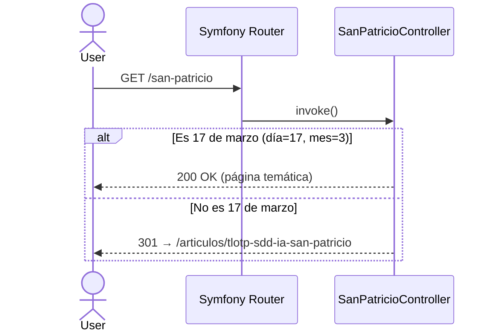

# Design — Redirect /san-patricio fuera de fecha

## Arquitectura

**Tipo de app**: Web (portfolio personal)
**Patrón**: Hexagonal (Ports & Adapters) + DDD
**Módulo afectado**: Controllers → SanPatricioController

---

## Diagrama de flujo

---

## Componentes

### SanPatricioController
- **Responsabilidad**: Punto de entrada HTTP para /san-patricio.
  Evalúa si hoy es el día de San Patricio y devuelve 301 o renderiza.
- **Dependencias**: ninguna externa
- **Interfaz**: `index(): Response`
- **Cambio**: Reemplazar lógica `EXPIRY_DATETIME` por comparación `d-m === '17-03'`

---

## Decisiones Técnicas (ADR)

### ADR-01 — Modelo de activación: caducidad puntual vs recurrencia anual

**Elegido**: Recurrencia anual (comparar día=17 y mes=3, año indiferente)
**Descartado**: Mantener EXPIRY_DATETIME con fecha del año siguiente
**Motivo**: La feature debe activarse cada 17/03 sin intervención manual.
**Consecuencias**: La constante EXPIRY_DATETIME desaparece. La lógica pasa
a comparar `$now->format('d-m') === '17-03'`.

### ADR-02 — Dónde reside la lógica de fecha

**Elegido**: Lógica directamente en SanPatricioController
**Descartado**: Crear un DateChecker en la capa de dominio
**Motivo**: La aventura es mínima (1 condicional). Extraer a domain service
sería over-engineering. Si la lógica crece, se extrae entonces.
**Consecuencias**: Solución más simple y mantenible.

---

## Consideraciones de Seguridad

- **Open redirect**: No aplica — la URL del redirect es una constante interna,
  sin input del usuario.
- **Headers**: La cabecera `Location` solo contiene una ruta interna relativa.
- **Dependencias**: No se añaden nuevas dependencias externas.

---

## Riesgos Técnicos

| Riesgo | Prob. | Impacto | Mitigación |
|--------|-------|---------|------------|
| Caché 301 en navegador impide ver la página el 17/03 siguiente | Media | Alto | Documentar; considerar 302 si se detecta como problema real |
| Test de fecha depende del reloj del sistema | Baja | Medio | Inyectar `\DateTimeImmutable` en tests para mockear la fecha |
