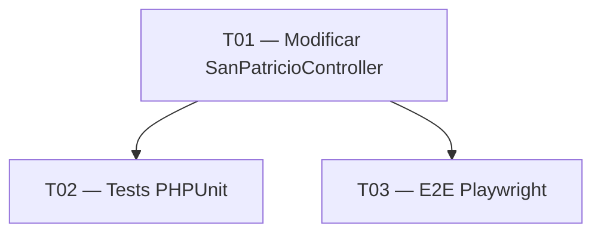

# Tasks — Redirect /san-patricio fuera de fecha

## Tareas

### T01 — Modificar SanPatricioController

**Tamaño**: S
**Depende**: ninguna

Reemplazar la lógica basada en `EXPIRY_DATETIME` por una comparación de día y mes
(`$now->format('d-m') === '17-03'`). Cuando no sea 17 de marzo, devolver un redirect
301 a `/articulos/tlotp-sdd-ia-san-patricio`. Cuando sí sea 17 de marzo, renderizar
la página temática tal como estaba.

**Criterios de aceptación**:
- [ ] La constante `EXPIRY_DATETIME` ha sido eliminada
- [ ] `GET /san_patricio` en fecha no-17/03 devuelve HTTP 301 con `Location: /articulos/tlotp-sdd-ia-san-patricio`
- [ ] `GET /san_patricio` el 17/03 devuelve HTTP 200 y renderiza `pages/san_patricio/index.html.twig`
- [ ] La lógica compara solo día y mes, no el año (funciona en 2026, 2027, 2028...)

---

### T02 — Tests PHPUnit del controller

**Tamaño**: S
**Depende**: T01

Añadir tests de integración/funcional que cubran ambos casos del controller.
La fecha se debe poder inyectar o mockear para no depender del reloj del sistema.

**Criterios de aceptación**:
- [ ] Test `testRedirectsWhenNotSanPatricioDay`: fecha 2025-01-15 → 301 a la URL correcta
- [ ] Test `testRendersSanPatricioPageOnSanPatricioDay`: fecha 2025-03-17 → 200
- [ ] `make stan` pasa sin errores (PHPStan level 9)
- [ ] `make test` pasa en verde

---

### T03 — E2E Playwright

**Tamaño**: S
**Depende**: T01

Verificar en local que el redirect funciona correctamente desde el navegador.
Si ya existe un test E2E de la ruta `/san_patricio`, actualizarlo para reflejar
el nuevo comportamiento.

**Criterios de aceptación**:
- [ ] Test E2E verifica que `/san_patricio` redirige a la URL del artículo
- [ ] `make e2e` pasa en verde contra `localhost:8080`
- [ ] `make lint` pasa sin errores (ESLint)

---

## Grafo de dependencias



---

## Resumen del viaje

```
📊 Resumen:
  S: 3 tareas  (avance rápido)
  M: 0 tareas
  L: 0 tareas
  XL: 0 tareas

  Total: 3 tareas · Tamaño estimado: S
```
