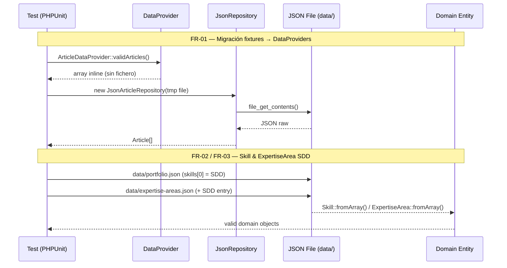

# Design — SDD Skill, Expertise & Test Refactoring

## Arquitectura

**Tipo de app**: Web portfolio (monolítico, server-rendered)
**Patrón**: Hexagonal (Ports & Adapters) + DDD sobre Symfony 6.4
**Persistencia**: JSON files (`data/`)
**Frontend**: Twig 3 + Vanilla JS + CSS modular

Los cambios de esta aventura tocan tres capas ortogonales:
1. **Tests de infraestructura** — migración fixtures → DataProviders
2. **Datos de dominio** — nuevas entradas en `data/*.json`
3. **CI/CD** — verificación de exclusiones en sync público

---

## Diagrama Mermaid

---

## Componentes

### C1 — ArticleDataProvider
- **Responsabilidad**: Proveer arrays inline de artículos de test
- **Reemplaza**: `tests/fixtures/articles-test.json`
- **Ubicación**: `tests/Integration/Infrastructure/Persistence/DataProvider/ArticleDataProvider.php`
- **Dependencias**: ninguna (datos estáticos)
- **Interfaz pública**: `static validArticles(): array`, `static invalidJsonCases(): array`

### C2 — PortfolioDataProvider
- **Responsabilidad**: Proveer arrays inline de portfolio válido e inválido
- **Reemplaza**: `tests/fixtures/portfolio-valid.json` + `portfolio-invalid.json`
- **Ubicación**: `tests/Integration/Infrastructure/Persistence/DataProvider/PortfolioDataProvider.php`
- **Dependencias**: ninguna (datos estáticos)
- **Interfaz pública**: `static validPortfolio(): array`, `static invalidPortfolio(): array`

### C3 — data/portfolio.json (modificado)
- **Responsabilidad**: Añadir skill SDD como primer elemento del array `skills`
- **Campos añadidos**: `name: "SDD"`, `level: "expert"`, `years: 1`, `stars: 5`, `description: [...]`
- **Posición**: índice 0 (primera skill visible en UI)

### C4 — data/expertise-areas.json (modificado)
- **Responsabilidad**: Añadir ExpertiseArea SDD en categoría arquitectura
- **Campos**: `id: "sdd"`, `label: "SDD"`, `full_title: "Specification Driven Development"`,
  `icon_type: "monogram"`, `icon_value: "S"`, `category: "arquitectura"`, `description: [...]`

### C5 — .github/scripts/sync-to-public.sh (verificado/modificado)
- **Responsabilidad**: Asegurar que `.claude/` no llega al repo público
- **Acción**: Verificar exclusiones actuales; añadir si falta

### C6 — .claude/rules/release-process.md (commit pendiente)
- **Responsabilidad**: Documentar que la PR de release es automática (no manual)
- **Estado**: Cambio ya aplicado localmente, pendiente de commit

---

## Decisiones Técnicas (ADR-lite)

### ADR-01 — DataProviders inline vs ficheros JSON de fixture

**Elegido**: DataProvider classes PHP con arrays inline
**Descartado**: Ficheros JSON en `tests/fixtures/`
**Motivo**: Los DataProviders son más mantenibles: viven junto al código
que testean, usan tipado PHP y no requieren IO de fichero.
Patrón ya establecido en `Domain/ExpertiseArea/DataProvider/`.
**Consecuencias**: Eliminar `tests/fixtures/articles-test.json`,
`portfolio-valid.json`, `portfolio-invalid.json`;
crear clases DataProvider en `Integration/DataProvider/`

### ADR-02 — SDD como skill separada de "Vibe Coding"

**Elegido**: Skill "SDD" como entrada independiente (posición 0)
**Descartado**: Modificar o renombrar la skill "Vibe Coding" existente
**Motivo**: SDD y Vibe Coding son disciplinas distintas. Vibe Coding es
un estilo de desarrollo fluido con IA; SDD es una metodología
de especificación formal. Mezclarlas perdería la identidad de ambas.
**Consecuencias**: `data/portfolio.json` tendrá 14 skills (una más);
la skill SDD aparecerá primera en la UI

---

## Consideraciones de Seguridad

- **Inputs**: Cambios en JSON estáticos y clases PHP de test. Sin inputs de usuario ni superficie de ataque nueva.
- **Datos sensibles**: Los ficheros `data/` son contenido público del portfolio. No contienen credenciales ni datos personales privados.
- **Sync público**: FR-04 garantiza que `.claude/rules/` y `.claude/teams/` no expongan configuración interna al repo público. Riesgo bajo pero de privacidad relevante.
- **Dependencias**: No se añaden nuevas dependencias PHP/NPM.

---

## Riesgos Técnicos

| Riesgo | Prob. | Impacto | Mitigación |
|--------|-------|---------|------------|
| DataProvider no cubre exactamente los mismos escenarios que el fixture | Media | Alto | Revisión línea a línea del fixture antes de eliminarlo; PHPUnit confirma misma cobertura |
| sync-to-public.sh ya excluye .claude/ (FR-04 no requiere cambio) | Alta | Bajo | Verificar el script antes de asumir que falta la exclusión |
| `years: 1` para SDD no refleja experiencia real si se actualiza después | Baja | Bajo | Campo fácilmente editable en data/portfolio.json |
