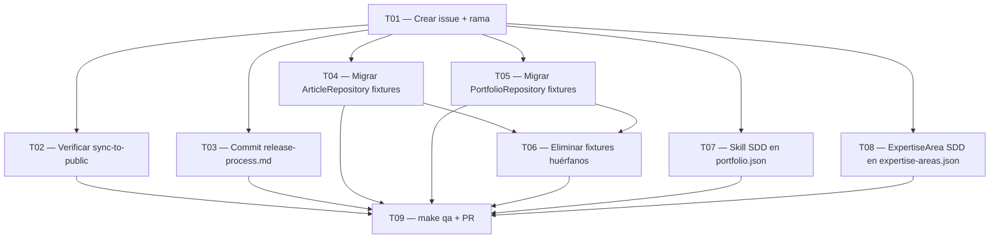

# Tasks — SDD Skill, Expertise & Test Refactoring

## Tareas

### T01 — Crear issue GitHub + rama feature
**Tamaño**: S | **Depende**: ninguna

Crear issue en GitHub con título y descripción de esta aventura.
Crear rama `feature/t{num}_sdd_skill_expertise` desde `origin/develop`.

Criterios de aceptación:
- [ ] Issue creada en GitHub con etiquetas apropiadas
- [ ] Rama feature creada desde `origin/develop` (no desde local)
- [ ] `git branch` muestra la rama activa correcta

---

### T02 — Verificar exclusión .claude/ en sync-to-public.sh
**Tamaño**: S | **Depende**: T01

Leer `.github/scripts/sync-to-public.sh` y comprobar si `.claude/rules/`
y `.claude/teams/` están excluidos del sync al repo público.
Si no lo están, añadir las exclusiones necesarias.

Criterios de aceptación:
- [ ] Confirmado que `.claude/rules/` NO se sincroniza al repo público
- [ ] Confirmado que `.claude/teams/` NO se sincroniza al repo público
- [ ] Si se añade exclusión: código commitado en rama feature

---

### T03 — Commit release-process.md pendiente
**Tamaño**: S | **Depende**: T01

Commitear el cambio ya aplicado en `.claude/rules/release-process.md`
(paso 2: la PR de release se crea automáticamente, no manualmente).
El fichero ya está modificado localmente — solo hay que stagear y commitear.

Criterios de aceptación:
- [ ] `git diff .claude/rules/release-process.md` no muestra cambios sin commitear
- [ ] El commit está en la rama feature (no en develop)
- [ ] Mensaje de commit sigue Conventional Commits (`docs(release): ...`)

---

### T04 — Migrar JsonArticleRepositoryTest: fixture → DataProvider
**Tamaño**: M | **Depende**: T01

Crear `ArticleDataProvider` con los datos inline del fixture
`tests/fixtures/articles-test.json`. Actualizar `JsonArticleRepositoryTest`
para usar el DataProvider en lugar del fichero JSON.
Eliminar `tests/fixtures/articles-test.json` cuando todos los tests pasen.

Criterios de aceptación:
- [ ] `ArticleDataProvider.php` creada en `tests/Integration/Infrastructure/Persistence/DataProvider/`
- [ ] `JsonArticleRepositoryTest` no referencia `FIXTURE_PATH` ni fichero JSON
- [ ] `tests/fixtures/articles-test.json` eliminado
- [ ] `make test` pasa sin errores

---

### T05 — Migrar JsonPortfolioRepositoryTest: fixture → DataProvider
**Tamaño**: M | **Depende**: T01

Crear `PortfolioDataProvider` con los datos inline del fixture
`tests/Fixtures/portfolio.json`. Actualizar `JsonPortfolioRepositoryTest`
para usar el DataProvider en lugar del fichero JSON.
Eliminar `tests/Fixtures/portfolio.json` cuando todos los tests pasen.

Criterios de aceptación:
- [ ] `PortfolioDataProvider.php` creada en `tests/Integration/Infrastructure/Persistence/DataProvider/`
- [ ] `JsonPortfolioRepositoryTest` no referencia `FIXTURE_PATH` ni fichero JSON
- [ ] `tests/Fixtures/portfolio.json` eliminado
- [ ] `make test` pasa sin errores

---

### T06 — Eliminar ficheros fixture huérfanos
**Tamaño**: S | **Depende**: T04, T05

Eliminar los ficheros JSON de fixture que no son referenciados por ningún test:
`tests/fixtures/portfolio-valid.json` y `tests/fixtures/portfolio-invalid.json`.
Si `tests/fixtures/` queda vacía, eliminar también el directorio.

Criterios de aceptación:
- [ ] `tests/fixtures/portfolio-valid.json` eliminado
- [ ] `tests/fixtures/portfolio-invalid.json` eliminado
- [ ] No existe ningún fichero JSON huérfano en `tests/fixtures/` ni `tests/Fixtures/`
- [ ] `make test` sigue pasando

---

### T07 — Añadir skill SDD en data/portfolio.json
**Tamaño**: S | **Depende**: T01

Insertar skill `SDD` como primer elemento del array `skills` en `data/portfolio.json`.
La descripción debe explicar la metodología SDD, mencionar TLOTP como prompt de
autoasistencia para generar SDDs correctos y enlazar al repositorio público.

Criterios de aceptación:
- [ ] `data/portfolio.json` → `skills[0].name === "SDD"`
- [ ] `skills[0].level === "expert"`, `stars === 5`, `years === 1`
- [ ] La descripción menciona TLOTP y enlaza al repo público
- [ ] La página `/portfolio` muestra SDD como primera skill en la UI

---

### T08 — Añadir ExpertiseArea SDD en data/expertise-areas.json
**Tamaño**: S | **Depende**: T01

Insertar nueva entrada `SDD` en `data/expertise-areas.json` con categoría
`arquitectura`. La descripción debe explicar la metodología, enlazar a
`docs/sdd_completed/` en el repo público y mostrar ejemplos reales
(TLOTP page, /tlotp).

Criterios de aceptación:
- [ ] Nueva entrada con `id: "sdd"`, `category: "arquitectura"`, `icon_type: "monogram"`, `icon_value: "S"`
- [ ] La descripción referencia `docs/sdd_completed/` en el repo público
- [ ] La descripción menciona al menos un ejemplo real (TLOTP page)
- [ ] La sección ExpertiseArea de arquitectura en la UI muestra la nueva entrada

---

### T09 — make qa + PR a develop
**Tamaño**: S | **Depende**: T02, T03, T04, T05, T06, T07, T08

Ejecutar el suite completo de QA local antes del push. Crear PR a `develop`
y esperar que el CI/CD esté en verde.

Criterios de aceptación:
- [ ] `make qa` pasa sin errores (PHPUnit + PHPStan + CS Fixer + ESLint)
- [ ] PR creada contra `develop` con descripción clara
- [ ] CI/CD de la PR en verde ✅
- [ ] PR mergeada a `develop`

---

## Grafo de dependencias



---

## Resumen del viaje

```
📊 Resumen del viaje:
  S: 6 tareas  (avance rápido)
  M: 2 tareas  (ritmo de La Comunidad)
  L: 0 tareas
  XL: 0 tareas

  Total: 8 tareas
```
