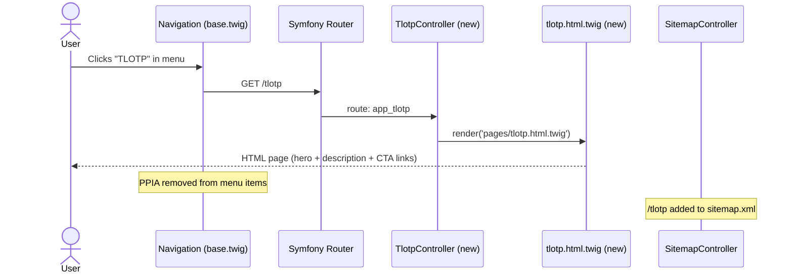

# Design — Página TLOTP + mejoras conexas

## Arquitectura

**Tipo de app**: Web (portfolio personal)
**Patrón**: Hexagonal (Ports & Adapters) + DDD
**Frontend**: Server-side Twig templates + Vanilla CSS/JS

### Diagrama de flujo — Página TLOTP

---

## Componentes

### C1 — TlotpController (NUEVO)
**Responsabilidad**: Manejar GET /tlotp y renderizar la página.
**Patrón**: Igual que PpiaController existente.
**Dependencias**: Symfony HttpFoundation · Twig
**Interfaz**: `#[Route('/tlotp')] → Response`

### C2 — tlotp.html.twig (NUEVO)
**Responsabilidad**: Template Twig de la página TLOTP.
**Estructura**: hero section + descripción + CTA/links
**Dependencias**: extends base.html.twig

### C3 — base.html.twig (MODIFICADO)
**Responsabilidad**: Actualizar nav: quitar PPIA, añadir TLOTP.
**Cambio mínimo**: Solo los items del nav afectados.

### C4 — SitemapController (MODIFICADO)
**Responsabilidad**: Añadir /tlotp al sitemap.xml.
**Cambio**: Nueva entry con changefreq y priority.

### C5 — sync-to-public.sh (MODIFICADO)
**Responsabilidad**: Incluir docs/sdd_completed/ en el sync.
**Ubicación**: .github/scripts/sync-to-public.sh

### C6 — Skill SDD (MODIFICADO desde vibe-coding)
**Responsabilidad**: Renombrar/actualizar skill con descripción
SDD + link a docs/sdd_completed/ en repo público.

### C7 — E2E Tests Playwright (NUEVOS)
**Responsabilidad**: Tests de la página /tlotp (POM estricto).
**Cobertura**: Navegación · contenido · link GitHub · PPIA ausente en menú.

---

## Decisiones Técnicas (ADR-lite)

### ADR-01 — Controller directo vs nuevo bounded context

**Elegido**: Controller + Twig directo (patrón PpiaController)
**Descartado**: Nuevo BC con entidad TlotpProject en dominio
**Motivo**: TLOTP es contenido estático de presentación, no
tiene estado ni lógica de negocio. Un BC nuevo sería over-engineering.
**Consecuencias**: Implementación rápida; si TLOTP crece en
complejidad se revisará.

### ADR-02 — Sync SDDs ampliando script existente

**Elegido**: Ampliar sync-to-public.sh con rsync de sdd_completed/
**Descartado**: Nuevo GitHub Actions job independiente
**Motivo**: El script ya gestiona auth y el flow completo.
Duplicar lógica en un job separado no aporta valor.
**Consecuencias**: SDDs se publican en cada deploy automáticamente.

---

## Consideraciones de Seguridad

- **Sin inputs de usuario**: La página TLOTP es contenido estático.
  No hay formularios, no hay vectores de inyección.
- **Twig auto-escaping**: Activo por defecto en Symfony —
  cualquier variable renderizada está escapada (XSS mitigado).
- **Sync público — datos sensibles**: docs/sdd_completed/ solo
  contiene documentos Markdown. Verificar antes del primer sync
  que no hay credenciales ni rutas internas en los SDDs.
- **OWASP A05 — Security Misconfiguration**: Sin nueva
  configuración de seguridad — ruta pública sin auth, consistente
  con el resto del portfolio.
- **Dependabot activo**: composer.json y package.json monitorizados.

---

## Riesgos Técnicos

| Riesgo | Prob. | Impacto | Mitigación |
|--------|-------|---------|------------|
| SDD con info sensible publicado en repo público | Baja | Alto | Revisar manualmente docs/sdd_completed/ antes del primer sync; añadir filter en el script si es necesario |
| E2E visual regression falla por diferencias de layout entre TLOTP y PPIA | Media | Bajo | Revisar snapshots tras implementación; ejecutar make e2e-update-snapshots si el diseño es intencionalmente diferente |
