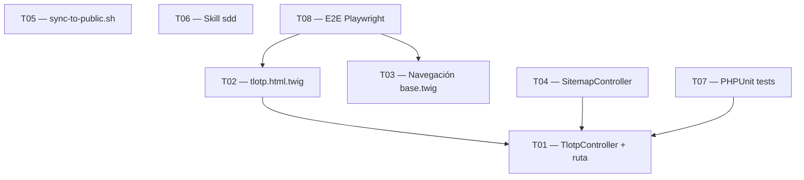

# Tasks — Página TLOTP + mejoras conexas

## Tareas

### T01 — Crear TlotpController + ruta /tlotp
**Tamaño**: S | **Depende de**: ninguna

Crear `src/Infrastructure/Http/TlotpController.php` siguiendo el mismo
patrón que `PpiaController`. Definir la ruta `#[Route('/tlotp', name: 'app_tlotp')]`
y renderizar la plantilla Twig correspondiente.

**Criterios de aceptación**:
- [ ] GET /tlotp devuelve HTTP 200
- [ ] La ruta `app_tlotp` existe y es accesible en el router de Symfony
- [ ] PHPStan level 9 no reporta errores en el nuevo controller

---

### T02 — Crear template tlotp.html.twig
**Tamaño**: S | **Depende de**: T01

Crear `templates/pages/tlotp.html.twig` con la misma estructura que
`ppia.html.twig`: hero section con nombre y tagline ("Un prompt para
controlarlos a todos"), descripción breve y sección CTA con enlace al
repositorio GitHub de TLOTP.

**Criterios de aceptación**:
- [ ] La página muestra el nombre "TLOTP" y el tagline visible en el hero
- [ ] Existe un enlace funcional al repositorio GitHub de TLOTP
- [ ] La estructura HTML sigue el mismo patrón que ppia.html.twig (reutiliza clases CSS existentes)

---

### T03 — Actualizar navegación en base.html.twig
**Tamaño**: S | **Depende de**: ninguna

Modificar `templates/base.html.twig` para quitar el enlace de PPIA del
menú de navegación principal y añadir el enlace a `/tlotp`.

**Criterios de aceptación**:
- [ ] El menú no contiene ningún enlace a /ppia
- [ ] El menú contiene un enlace a /tlotp con el texto "TLOTP"
- [ ] La ruta /ppia sigue devolviendo HTTP 200 al acceder directamente (no 404)

---

### T04 — Actualizar SitemapController con /tlotp
**Tamaño**: S | **Depende de**: T01

Añadir la URL `/tlotp` a la lista de URLs generadas en `SitemapController`
con los valores adecuados de `changefreq` (monthly) y `priority` (0.7).

**Criterios de aceptación**:
- [ ] La URL https://josemoreupeso.es/tlotp aparece en el sitemap.xml generado
- [ ] El sitemap tiene `changefreq` y `priority` definidos para /tlotp
- [ ] PHPStan level 9 no reporta errores en el controller modificado

---

### T05 — Actualizar sync-to-public.sh para incluir docs/sdd_completed/
**Tamaño**: S | **Depende de**: ninguna

Modificar `.github/scripts/sync-to-public.sh` para que el directorio
`docs/sdd_completed/` se sincronice al repositorio público en cada deploy.

**Criterios de aceptación**:
- [ ] El script incluye docs/sdd_completed/ en la lista de rutas sincronizadas
- [ ] Un dry-run del script confirma que los SDDs se incluirían en el sync
- [ ] El script no expone rutas ni contenidos sensibles del repositorio privado

---

### T06 — Actualizar skill vibe-coding → sdd
**Tamaño**: S | **Depende de**: ninguna

Localizar la skill "vibe-coding" en `~/.claude/skills/` o `.claude/skills/`
y actualizarla: renombrar a "sdd", actualizar nombre, descripción y
metadata para reflejar la metodología Spec-Driven Development. Incluir
en la descripción un link a `docs/sdd_completed/` del repositorio público.

**Criterios de aceptación**:
- [ ] La skill se llama "sdd" (no "vibe-coding")
- [ ] La descripción explica qué es SDD y cuándo usar la skill
- [ ] La descripción incluye el link al repositorio público (docs/sdd_completed/)

---

### T07 — Tests PHPUnit para TlotpController
**Tamaño**: S | **Depende de**: T01

Crear tests unitarios/funcionales para `TlotpController` en
`tests/Infrastructure/Http/TlotpControllerTest.php` siguiendo el
patrón de tests existentes para otros controllers.

**Criterios de aceptación**:
- [ ] El test verifica que GET /tlotp devuelve HTTP 200
- [ ] El test verifica que la respuesta contiene el texto "TLOTP"
- [ ] `make test` pasa sin errores con los nuevos tests incluidos

---

### T08 — E2E Playwright — página /tlotp (POM estricto)
**Tamaño**: M | **Depende de**: T02, T03

Crear Page Object en `playwright/pages/TlotpPage.ts` y test spec en
`playwright/tests/specs/tlotp.spec.ts` cubriendo: navegación al /tlotp
desde el menú, verificación del contenido, enlace a GitHub funcional y
ausencia de PPIA en el menú.

**Criterios de aceptación**:
- [ ] Existe `playwright/pages/TlotpPage.ts` con selectores en archivo `selectors.ts` dedicado
- [ ] El test verifica que "TLOTP" y el tagline son visibles en la página
- [ ] El test verifica que el enlace a GitHub existe y no está roto (href presente)
- [ ] El test verifica que el nav NO contiene el enlace a /ppia
- [ ] `make e2e` pasa sin errores con los nuevos tests

---

## Grafo de dependencias



---

## Resumen del viaje

```
📊 Resumen del viaje:
  S: 7 tareas  (avance rápido)
  M: 1 tarea   (ritmo de La Comunidad)
  L: 0 tareas
  XL: 0 tareas

  Total: 8 tareas · Tamaño estimado: pequeño-medio
```
